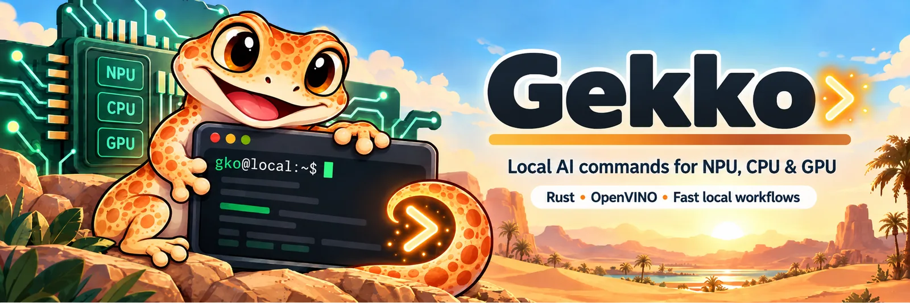

<p align="center">
  
</p>

<h1 align="center">Gekko</h1>

<p align="center">
  <strong>Your AI commands are configuration, not code.</strong>
</p>

<p align="center">
  <a href="https://github.com/fmatsos/gekko/actions/workflows/qa.yml"></a>
  <a href="https://github.com/fmatsos/gekko/releases/latest"></a>
  <a href="LICENSE"></a>
</p>

<p align="center">
  <a href="https://fmatsos.github.io/gekko/"><b>Website</b></a> ·
  <a href="https://fmatsos.github.io/gekko/docs/"><b>Documentation</b></a> ·
  <a href="https://github.com/fmatsos/gekko/releases"><b>Releases</b></a> ·
  <a href="CHANGELOG.md"><b>Changelog</b></a>
</p>

Gekko (`gko` on the command line) is a generic CLI engine for running local AI commands, written
in Rust, against any OpenAI-compatible model server — OVMS on an Intel NPU, `llama-server` on
Apple Silicon, or anything else that speaks the protocol.

`gko` hard-codes no business commands. There is no `classify`, no `summarize`, no `transcribe` in
the binary. You declare your own commands as configuration files, and the CLI builds its command
tree from them at startup. Adding, changing or removing a command never requires recompiling, and a
repository can ship its own `.gekko/` directory to get project-specific AI tooling without shipping
any executable code.

## Highlights

- **Commands are Markdown files.** TOML frontmatter declares the model, the input, the flags and
  the output contract; the body is the prompt. The path becomes the command name, and nested
  directories become nested subcommands.
- **Any OpenAI-compatible backend.** A command names a model; a model names a backend and one of
  its operations. `gko backend serve` starts a backend's runtime — a Docker container or a local
  process — from its `[runtime]` table.
- **Output contracts.** Text or JSON validated against a JSON Schema. A malformed structured
  response is an execution failure, never something `gko` quietly repairs.
- **Built to be driven.** stdout carries the command result and nothing else, the exit codes are a
  contract, and `gko mcp serve` exposes every configured command as an MCP tool.
- **Prompt regression tests.** `gko config test` runs test cases against your configured commands.
- **Hardware tooling.** `gko model discover` and `gko backend tune` help prepare a configuration
  for Intel/OpenVINO and Hugging Face.

## Installation

Grab the binary for your platform — Linux, macOS or Windows, x86_64 or aarch64 — from the
[latest release](https://github.com/fmatsos/gekko/releases/latest) and put `gko` anywhere on your
`PATH`. Later releases install in place with `gko update`.

Or build from source with [rustup](https://rustup.rs), which picks the pinned toolchain by itself:

```sh
git clone https://github.com/fmatsos/gekko.git gekko
cd gekko
cargo install --path .
```

```console
$ gko --version
gko 0.8.0
```

`gko` is not published to crates.io. Prerequisites, Windows support and the optional Cargo feature
are covered in the [installation guide](docs/installation.md).

## Quick start

Four concepts, each in its own file:

| Concept | Declares | Lives in |
| --- | --- | --- |
| **Backend** | runtime protocol, connection details, available operations | `backends/*.toml` |
| **Model** | a concrete model id, its backend, the backend operation it uses | `models/*.toml` |
| **Command** | user intent, prompt, accepted input, CLI arguments, output contract | `commands/*.md` |
| **Schema** | the JSON contract a structured command must satisfy | `schemas/*.json` |

Create a `.gekko/` directory in your project:

```text
.gekko/
├── backends/
│   └── ovms.toml
├── models/
│   └── qwen-fast.toml
└── commands/
    └── commit-message.md
```

**`.gekko/backends/ovms.toml`** — where to send requests:

```toml
id = "ovms"
type = "openai-compatible"
base_url = "http://127.0.0.1:8000"

[operations.chat]
method = "POST"
path = "/v3/chat/completions"
```

**`.gekko/models/qwen-fast.toml`** — which model, on which backend operation:

```toml
id = "qwen-fast"
backend = "ovms"
operation = "chat"
model = "qwen-2.5-1.5b"

[generation]
temperature = 0.0
max_tokens = 512
```

**`.gekko/commands/commit-message.md`** — the command itself. TOML frontmatter between `---`
fences, and the prompt as the body:

```markdown
---
description = "Generate a conventional commit message"
model = "qwen-fast"

[input]
mode = "stdin"

[output]
format = "text"
max_lines = 1
---

Generate a Conventional Commit message from the supplied diff.

Return exactly one commit message.

Do not use Markdown.
Do not explain your answer.

{{ input }}
```

The filename becomes the command name, so this is now a real subcommand:

```sh
git diff --cached | gko commit-message
```

`gko doctor` validates your configuration, probes every configured backend and compiles every
declared output schema — the fastest way to tell whether a setup problem is yours or your
runtime's.

> [!TIP]
> [Writing commands](docs/commands.md) covers arguments, templating and input modes;
> [Configuration](docs/configuration.md) covers scopes, backends and models.

## Exit codes

`gko` is designed to be called by other programs, including coding agents. Exit codes are a
contract, not an afterthought.

| Code | Meaning | Who should act |
| ---: | --- | --- |
| `0` | Success | — |
| `1` | I/O or update error (unreadable file, failed download/replacement) | You |
| `2` | Configuration error — your files are wrong | You: fix the named file |
| `3` | Backend error — unreachable, or an HTTP failure | Your runtime: start or fix it |
| `4` | Output contract violation — the model answered badly | Your prompt or your schema |

Every configuration error names the offending file, and where relevant the line.

## Documentation

The guides live in [`docs/`](docs/README.md) and are published on the
[website](https://fmatsos.github.io/gekko/docs/): installation, configuration, writing commands,
output contracts, prompt tests, the MCP server, the built-in commands, and deploying on an Intel
NPU or on Apple Silicon. The [Claude Code skills](skills/README.md) teach Claude Code to write and
repair a `gko` configuration, and to find and export a model.

## Development

```sh
make qa       # fmt + clippy (-D warnings) + tests + cargo-deny
make fix      # apply rustfmt and clippy autofixes
make modules  # print the module structure (diagnostic only)
```

`make qa` is the single gate, and the one CI runs: rustfmt, Clippy with the `all` and `pedantic`
groups as hard errors, the full test suite, and `cargo-deny` for advisories, licences and
duplicate crates. `unsafe` code is forbidden crate-wide.

## License

Public domain, see [LICENSE](LICENSE) ([Unlicense](https://unlicense.org)).
